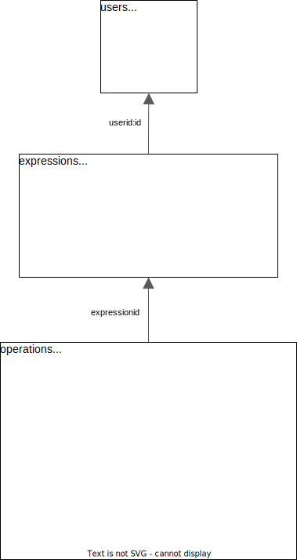

# Distributed arithmetic expression evaluator
[](https://klef99.github.io/distributed-calculation-swagger/)
<!-- [](./docs/openapi.yaml) -->

## Technology stack

* Golang
* PostgreSQL
* Redis
* Docker
* Docker-compose
* OpenAPI
* Swagger

## Description

The user wants to calculate arithmetic expressions. He enters the string 2 + 2 * 2 and wants the answer to be 6. But our addition and multiplication operations (also division and subtraction) take a “very, very” long time to complete. Therefore, the option in which the user makes an http request and receives the result as a response is impossible. Moreover: the calculation of each such operation in our “alternative reality” takes “giant” computing power. Accordingly, we must be able to perform each action separately and we can scale this system by adding computing power to our system in the form of new “machines”. Therefore, when a user sends an expression, he receives an expression identifier in response and can, at some periodicity, check with the server whether the expression has been counted? If the expression is finally evaluated, he will get the result. Remember that some parts of an arphimetic expression can be evaluated in parallel.

## Requirements

### Front-end part (implemented as pure api requests)

* Arithmetic expression input form. The user enters an arithmetic expression and sends a POST http request with this expression to the back-end. Note: Requests must be idempotent. A unique identifier is added to requests. If a user sends a request with an identifier that has already been sent and accepted for processing, the response is 200. Possible response options:

    * [200]. The expression was successfully accepted, parsed and accepted for processing
    * [400]. The expression is invalid
    * [500]. Something is wrong on the back-end. As a response, you need to return the id of the expression accepted for execution.

* Page with a list of expressions in the form of a list with expressions. Each entry on the page contains a status, an expression, the date it was created, and the date the calculation was completed. The page receives data with a GET http request from the back-end
* A page with a list of operations in the form of pairs: operation name + execution time (editable field). As already stated in the problem statement, our operations take “as if for a very long time.” The page receives data with a GET http request from the back-end. The user can configure the operation execution time and save the changes.
* Page with a list of computing capabilities. The page receives data with a GET http request from the server in the form of pairs: the name of the computing resource + the operation performed on it.

Requirements:

* The orchestrator can be restarted without losing state. We store all expressions in the DBMS.
* The orchestrator must keep track of tasks that take too long to complete (the computer may also go offline) and make them available for computation again.

### Back-end part

Consists of 2 elements:

* The server, which receives an arithmetic expression, translates it into a set of sequential tasks and ensures the order in which they are executed. From now on we will call it Orchestrator.
* A computer that can receive orchestrator task, execute it and return the result to the server. In what follows we will call it Agent.

Orchestrator
Server that has the following endpoints:

* Adding an arithmetic expression evaluation.
* Getting a list of expressions with statuses.
* Getting the value of an expression by its identifier.
* Obtaining a list of available operations with their execution time.
* Receiving a task for execution.
* Receiving the result of data processing.

The Daemon Agent
Receives an expression to be evaluated from the server, evaluates it and sends the result of the expression to the server. When starting, the daemon launches several goroutines, each of which acts as an independent computer. The number of goroutines is controlled by an environment variable.

## Getting Started

### Prerequisites

To start project you need:
* [Docker](https://www.docker.com/)
* [Docker compose](https://docs.docker.com/compose/install/)

### Building from source
1) `cd <"path/to/project/root/directory">`
2) Set passwords for redis and postgresql in the file  `.env.example`
3) Rename `.env.example` to `.env` 
4) `docker-compose -f docker-compose.yml up  -d`

## Description of requests:
### Registration
POST `http://localhost:8080/register`
#### Request Body:
  ```json
{
    "login": "klef99",
    "password": "123abCC"
}
```
#### Response body:
OK, if the registration is successful. Otherwise, the HTTP code is not 200.

### Authorization
POST `http://localhost:8080/login`
#### Request body:
  ```json
{
    "login": "klef99",
    "password": "123abCC"
}
```
#### Response body:
JWT token if registration is successful. Otherwise, the HTTP code is not 200.
### Get agent status:
GET `http://localhost:8080/getWorkersStatus`
#### Response body:
```json
[
    {
        "workerName": "worker1",
        "status": "OK",
        "taskCount": "2"
    }
]
```
The agent is considered unavailable if a minute has passed since the last heartbeat. If no agent is available, the expressions are not sent for calculation. taskCount - the number of operations currently being calculated. Since this is a method for internal use, it does not require a token.
## The following methods require a jwt token in Headers
The view is as follows: Authorization: Bearer \<token>
### Send an expression:
POST `http://localhost:8080/addExpression`

In this request, the user can send his id as an idempotence key. If header:X-Request-Id is empty, the server-generated uuid is returned in the response body. Otherwise, the user's uuid is used. To create a uuid, you can use this [site](https://www.uuidgenerator.net).

#### Request body:
  ```json
  {
      "expression": "2+2/1+2/1"
  }
  ```
#### Response body:
```json
{
    "expressionid": "603b53cb-2175-46bd-a15f-bfba1e1918fb",
    "expression": "2+2/1+2/1",
    "status": 0
}
```
### Get the status of an expression by id:
GET `http://localhost:8080/getExpressionByID?expressionId=<expressionid>`
#### Response body:
```json
{
    "expressionid": "6c992cda-5565-4123-a004-4bd645b5de63",
    "expression": "((9*7)-(4/2)+(6*3)/(15-3)*(10+2))+(5-2)/(8*2)*(7/1)",
    "status": 2,
    "result": 80.3125
}
```
#### Values of expression status codes:
1. 0 - The expression was added to the database.
2. 1 - The expression was divided into elementary operations.
3. 2 - The expression was calculated (result != null)
4. -1 - The expression was invalidated during calculation.

### Getting information about all expressions of the current user in the database:
GET `http://localhost:8080/getExpressionsList`
#### Response body:
```json
[
    {
        "expressionid": "edd8d169-7e60-41ea-8d3c-e8766718461a",
        "expression": "(1+1))",
        "status": -1,
        "result": null
    },
    {
        "expressionid": "d4be595a-f538-4132-a14b-efe7784d5aa5",
        "expression": "((5*3)+(8/2)-(7*4)/(6-3)*(9+1)/(2*5)-(6/2)+(3*2)+(4-1)/(9*1)*(2+7)/(8-6)*(5/5))",
        "status": 2,
        "result": 14.166666666666666
    },
    {
        "expressionid": "603b53cb-2175-46bd-a15f-bfba1e1918fb",
        "expression": "2+2/1+2/1",
        "status": 2,
        "result": 6
    }
]
```
### Set the calculation time of a single operation:
POST `http://localhost:8080/setOperationsTimeout `
#### Request body:
  ```json
{
    "*": 3,
    "+": 5,
    "-": 5,
    "/": 10
}
  ```
The body can contain any number of operations (from 0 to 4). If there is no data about any operation in redis, then the default value is set for this operation (10 seconds). Timeout in seconds.
#### Response body:
```
OK
```
### Get the calculation time of one operation:
GET `http://localhost:8080/getOperationsTimeout`
#### Response body:
  ```json
{
    "*": 3,
    "+": 5,
    "-": 5,
    "/": 10
}
  ```

## Specifications:
1. [Criteria](/docs/criteria.md)
## No frontend
For a more convenient introduction to the system, you should use [postman](https://www.postman.com/downloads)
[Postman file](docs/Distibuted%20calculation.postman_collection.json).
Also available OpenAPI [configuration file](docs/openapi.yaml).

# The general scheme of the system

# Database schema
